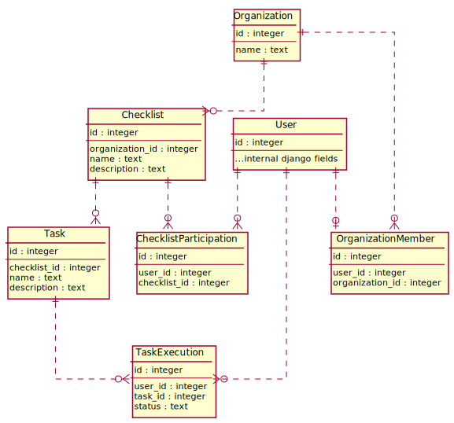

# Onboarding App Backend

This is the backend part of the Onboarding app developed
for the MAD course at Innopolis University.

## Data Model



## Contributing

For running a development server for this project you
should either use the Makefile or run commands defined
in the Makefile manually.

### Using Makefile

Firstly, initialize development environment via the
following command:

```sh
make dev
```

Then, use `docker-compose` for starting and stopping
services.  
For example:

```sh
# To build and start
docker-compose up -d --build

# To stop and remove containers
docker-compose down

# Like previous but also deletes volumes (e.g. database)
docker-compose down -v
```

The webserver will be available at `localhost:8000`.

### Manually

Run the following commands (same as `make dev`):

```sh
# Set up environment for docker-compose
cp .env.dev .env
echo "DOCKER_USER=$(id -u):$(id -g)" >> .env

# Override default compose file with development extensions
ln -sf docker-compose.dev.yml docker-compose.override.yml

# Add pre-commit hook for schema generation
# (only if you'd like to modify the schema)
cp schema/pre-commit.sample .git/hooks/pre-commit
```

Then, you can use `docker-compose` for managing services
(see examples in the previous section).
